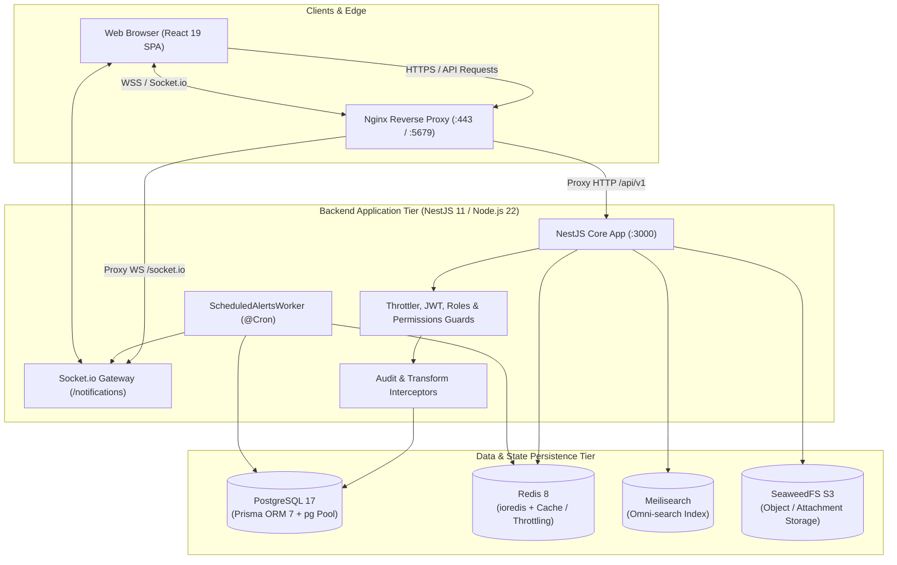
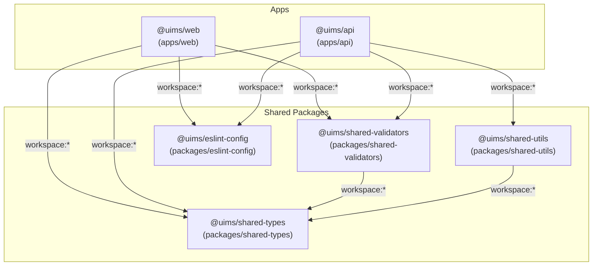
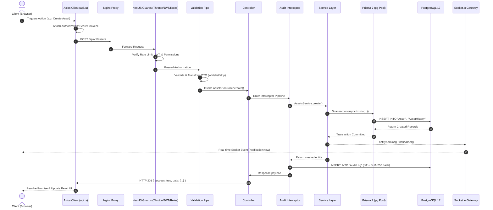

# Architecture Overview
**Analysis Date:** 2026-09-09

## System Overview
UIMS (Unified IT Management System) is an enterprise-grade IT infrastructure, asset, and identity management platform. Built on a high-performance TypeScript monorepo, UIMS provides unified lifecycle management across hardware assets, software licenses, organizational directories, network IPAM (IP Address Management), role-based access control (RBAC), and automated compliance auditing.

The system features a decoupled, multi-tier architecture:
- **Presentation Tier**: React 19 Single Page Application (SPA) styled with Ant Design v6 and Ant Design Pro Components, utilizing Vite for HMR and optimized production chunking.
- **API & Application Tier**: NestJS 11 backend framework running on Node.js (>=22.0.0), exposing a modular REST API (`/api/v1`) along with a real-time WebSocket Gateway (`/notifications`) via Socket.io.
- **Data & Persistence Tier**: PostgreSQL 17 managed via Prisma ORM 7 with native connection pooling (`@prisma/adapter-pg`), Redis 8 for distributed caching and alert throttling, Meilisearch for indexed omni-search, and SeaweedFS for S3-compatible asset document and attachment storage.
- **Proxy & Edge Tier**: Nginx reverse proxy terminating TLS and routing requests to web and API upstream services.

## Monorepo Structure
The repository is managed using **pnpm workspaces** (`pnpm@11.21.0`) coordinated by **Turborepo** (`turbo@^2.10.12`). All packages reside either in `apps/` or `packages/`.

### Dependency Graph & Workspace Rules
- `apps/api`: Consumes `@uims/shared-types`, `@uims/shared-validators`, `@uims/shared-utils`, and `@uims/eslint-config`.
- `apps/web`: Consumes `@uims/shared-types`, `@uims/shared-validators`, and `@uims/eslint-config`. In development, Vite resolves package source files directly via path aliases (`@uims/shared-* -> ../../packages/shared-*/src`).
- `packages/shared-validators`: Depends on `@uims/shared-types` and `zod`.
- `packages/shared-utils`: Depends on `@uims/shared-types`, `dayjs`, and `dayjs/plugin/*`.
- `packages/shared-types`: Pure TypeScript contract definitions with zero runtime dependencies.
- `packages/eslint-config`: Shared `typescript-eslint` recommended config and `eslint-config-prettier`.

---

## Backend Architecture

### Bootstrap
The API application boots from `apps/api/src/main.ts`:
1. **NestFactory Initialization**: Instantiates `AppModule` with buffered logs (`bufferLogs: true`).
2. **Shutdown Hooks**: `app.enableShutdownHooks()` enables graceful termination on SIGINT/SIGTERM.
3. **Global Prefix**: All REST endpoints are prefixed under `api/v1`.
4. **Security Headers**: `helmet` is registered globally with strict HSTS (1 year maxAge, includeSubDomains, preload).
5. **CORS Policy**: Configured strictly against `CORS_ORIGIN` / `ALLOWED_ORIGINS`, permitting development origins (`http://localhost:5679`, `https://localhost:5679`, `http://localhost:3000`, `http://localhost:3002`), Cloudflare tunnel domains (`*.trycloudflare.com`), with credentials enabled.
6. **Compression & Cookies**: Express middleware `compression()` and `cookie-parser()` handle Gzip/Brotli payload compression and cookie parsing.
7. **Global Validation Pipe**: `ValidationPipe` enforces `whitelist: true`, `transform: true`, and `forbidNonWhitelisted: true`.
8. **Global Interceptors & Filters**:
   - `TransformInterceptor`: Enforces consistent JSON envelope formatting.
   - `HttpExceptionFilter` & `PrismaExceptionFilter`: Standardizes exception payloads and transforms Prisma errors.
9. **OpenAPI / Swagger**: Configured at `/api/v1/docs` with Bearer authentication for interactive testing.
10. **Port & Binding**: Binds to `0.0.0.0` on port specified by `PORT` or `APP_PORT` (default: 3000).

### Module Graph
All feature and core modules are registered in `apps/api/src/app.module.ts`:

#### Core & Infrastructure Modules
| Module | Location | Purpose | Key Providers / Services |
| :--- | :--- | :--- | :--- |
| `ConfigModule` | `@nestjs/config` | Global environment configuration and Zod validation | `ConfigService`, `getAppConfig` |
| `ScheduleModule` | `@nestjs/schedule` | Cron scheduling engine | `SchedulerRegistry` |
| `ThrottlerModule` | `@nestjs/throttler` | Rate limiting protection (1000 req / 60s) | `ThrottlerGuard` |
| `RedisModule` | `src/common/redis/redis.module.ts` | Redis connection management with in-memory fallback | `RedisService` |
| `PrismaModule` | `src/database/prisma.module.ts` | Database connection pool via `@prisma/adapter-pg` | `PrismaService` |

#### Feature Modules (16 Registered Modules)
| Feature Module | Controller | Service / Gateway / Worker | Prisma Entities Involved |
| :--- | :--- | :--- | :--- |
| **`AuthModule`** | `AuthController` | `AuthService`, `JwtStrategy`, `AuthGuard` | `AppUser`, `RefreshToken`, `Role` |
| **`RolesModule`** | `RolesController` | `RolesService` | `Role`, `Permission`, `RolePermission` |
| **`UsersModule`** | `UsersController` | `UsersService` | `AppUser`, `Role` |
| **`DirectoryModule`** | `DirectoryController` | `DirectoryService` | `DirectoryUser`, `DirectoryGroup`, `DirectoryMembership`, `Department`, `Position`, `Location`, `Organization` |
| **`OrganizationModule`** | `OrganizationController` | `OrganizationService` | `Organization`, `Department`, `Position`, `Location`, `Vendor` |
| **`AssetsModule`** | `AssetsController` | `AssetsService` | `Asset`, `AssetCategory`, `AssetHistory`, `DirectoryUser`, `Location` |
| **`LicensesModule`** | `LicensesController` | `LicensesService` | `License`, `LicenseAssignment`, `DirectoryUser` |
| **`InventoryModule`** | `InventoryController` | `InventoryService` | `InventoryItem` |
| **`NetworkModule`** | `NetworkController` | `NetworkService` | `IPAddress`, `Subnet`, `VLAN` |
| **`AuditModule`** | `AuditController` | `AuditService` | `AuditLog`, `AppUser` |
| **`ReportsModule`** | `ReportsController` | `ReportsService` | `ReportSchedule`, `Asset`, `License`, `InventoryItem` |
| **`SettingsModule`** | `SettingsController` | `SettingsService` | `Setting` |
| **`DashboardModule`** | `DashboardController` | `DashboardService` | `Asset`, `License`, `InventoryItem`, `IPAddress` |
| **`HealthModule`** | `HealthController` | Internal health probes | Database, Redis status |
| **`SearchModule`** | `SearchController` | `SearchService` | Cross-entity search (Assets, Licenses, Users, Inventory, Network) |
| **`NotificationsModule`**| `NotificationsController` | `NotificationsService`, `NotificationsGateway`, `ScheduledAlertsWorker` | `Notification`, `AppUser` |

### Guards & Middleware
Execution flow follows a deterministic order via global providers in `AppModule`:
1. **`ThrottlerGuard`** (`APP_GUARD`): Enforces IP-based and user-based rate limiting (1000 requests per 60 seconds).
2. **`JwtAuthGuard`** (`APP_GUARD`): Extends Passport JWT auth. Inspects incoming `Authorization: Bearer <token>`. Allows unauthenticated requests only if the handler is decorated with `@Public()`.
3. **`RolesGuard`** (`APP_GUARD`): Evaluates `@Roles('ADMIN', ...)` decorators against the user's role. Automatically bypasses checks for `SUPER ADMIN`.
4. **`PermissionsGuard`** (`APP_GUARD`): Evaluates granular permissions required by `@RequirePermissions('asset:create', ...)` by resolving assigned role permissions from DB/cache.

#### Interceptors
- **`AuditInterceptor`** (`APP_INTERCEPTOR`): Intercepts all mutating requests (`POST`, `PUT`, `PATCH`, `DELETE`). Extracts user identity, target resource, client IP (supporting reverse proxy headers), sanitizes sensitive parameters (`password`, `token`, `secret`, `apiKey`), computes HMAC SHA-256 cryptographic checksums for tamper evidence, and persists an `AuditLog` entry.
- **`TransformInterceptor`** (`main.ts`): Envelopes all successful outgoing HTTP responses into `{ success: true, data: T, timestamp: string }`.

#### Filters
- **`HttpExceptionFilter`**: Traps NestJS `HttpException` instances and renders a structured error format with accurate HTTP status, error codes, and validation details.
- **`PrismaExceptionFilter`**: Translates Prisma errors into standard HTTP responses:
  - `P2002` (Unique constraint) -> `409 Conflict`
  - `P2025` (Record not found) -> `404 Not Found`
  - `P2003`, `P2014`, `P2000` (Foreign key constraint, relation violation, value length) -> `400 Bad Request`

#### Custom Decorators
- `@Public()`: Marks a controller or route method as public, bypassing `JwtAuthGuard`.
- `@Roles(...roles: string[])`: Declares role requirements for the endpoint.
- `@RequirePermissions(...permissions: string[])`: Declares fine-grained permission requirements (`<subject>:<action>`).
- `@ClientIp()`: Resolves true client IP from `X-Forwarded-For`, `X-Real-IP`, or TCP socket.

### Data Access Patterns
- **Prisma 7 Adapter Connection Pooling**: `PrismaService` extends `PrismaClient` configured with `@prisma/adapter-pg` and a `pg.Pool` instance (default pool size: 20 connections, idle timeout: 30s).
- **Transactions**: Multi-table operations utilize interactive transactions via `this.prisma.$transaction(async (tx) => { ... })` (e.g. creating an asset while auto-resolving or creating its category, location, and history entry).
- **Soft vs. Lifecycle Statuses**: Rather than blanket `deletedAt` timestamps, entities track explicit business lifecycles using database enums and boolean flags:
  - `Asset`: `AssetStatus` (`AVAILABLE`, `IN_USE`, `MAINTENANCE`, `RETIRED`, `LOST`)
  - `License`: `LicenseStatus` (`ACTIVE`, `EXPIRED`, `EXPIRING_SOON`, `REVOKED`)
  - `AppUser`: `UserStatus` (`ACTIVE`, `INACTIVE`, `SUSPENDED`) + `isLocked`
  - `DirectoryUser`: `AccountStatus` (`ACTIVE`, `DISABLED`, `LOCKED`, `SUSPENDED`) + `isClosed`
  - `RefreshToken`: `isRevoked`
- **Pagination Pattern**: Standardized via `PaginationDto` (`page?: number = 1`, `limit?: number = 10`), computing `skip = (page - 1) * limit` and `take: limit`.

### Background Jobs & Workers
- **Engine**: `@nestjs/schedule` (`ScheduleModule.forRoot()`).
- **`ScheduledAlertsWorker`** (`src/modules/notifications/scheduled-alerts.worker.ts`):
  - Cron trigger: `@Cron('0 0 * * *')` (midnight UTC daily).
  - Tasks executed concurrently via `Promise.allSettled`:
    1. `scanExpiringLicenses()`: Detects licenses expiring within 30, 15, 7, or 1 days, and transitions expired ones to `EXPIRED`.
    2. `scanExpiringWarranties()`: Scans active hardware assets with warranty expiring within 30, 15, or 7 days.
    3. `scanOverdueMaintenance()`: Detects assets in `MAINTENANCE` status exceeding 14 days.
    4. `scanLowStock()`: Scans inventory items where `quantity <= minThreshold` (flags out of stock when `0`).
  - **Deduplication & Throttling**: Uses `RedisService` to store alert keys (e.g., `alert:license:expiring:${id}:7d`) with TTL cooldowns (e.g., 3 to 14 days) to prevent notification fatigue.
  - **Live Dispatch**: Emits real-time alerts to admins via `NotificationsGateway` and creates database `Notification` records.
- **Queue Architecture (BullMQ)**: BullMQ (`bullmq@^6.3.4` and `@nestjs/bullmq@^11.0.5`) is present in the project dependencies, prepared for asynchronous queue processing.

---

## Frontend Architecture

### Routing & Code Splitting
Implemented in `apps/web/src/app/router.tsx` using `createBrowserRouter` from `react-router` (v8.3.1):
- **Lazy Loading**: Every page route is wrapped with `React.lazy()` and rendered inside `React.Suspense` with a custom `PageLoader` indicator.
- **Error Boundaries**: Every top-level route and layout defines `ErrorBoundary: RouteErrorBoundary` to isolate errors and prevent white-screen crashes.
- **Layout Architecture**:
  - `AuthLayout`: Root layout managing user session authentication and redirection.
  - `MainLayout`: Authenticated master layout containing the responsive sidebar, navigation bar, command palette, notification drawer, and dynamic breadcrumbs.

#### Route Table
| Route Path | Layout | Component / Page | Description |
| :--- | :--- | :--- | :--- |
| `/login` | None | `LoginPage` | User login and authentication entry |
| `/` | `MainLayout` | `DashboardPage` | Executive telemetry and KPI dashboard |
| `/assets` | `MainLayout` | `AssetsPage` | Hardware asset lifecycle, table, QR scanner |
| `/licenses` | `MainLayout` | `LicensesPage` | Software licenses and seat allocations |
| `/access-control`| `MainLayout` | `AccessControlPage` | RBAC roles, permission matrix, app users |
| `/directory` | `MainLayout` | `DirectoryPage` | Employee directory and AD/LDAP groups |
| `/organization` | `MainLayout` | `OrganizationPage` | Visual organizational hierarchy tree canvas |
| `/users` | `MainLayout` | Navigate (`/access-control`) | Legacy alias redirecting to Access Control |
| `/network` | `MainLayout` | `NetworkPage` | IPAM, subnets, IP allocation, ping tools |
| `/inventory` | `MainLayout` | `InventoryPage` | Stockroom inventory, SKUs, and restock levels |
| `/audit` | `MainLayout` | `AuditPage` | Tamper-evident audit logs and diff inspections |
| `/reports` | `MainLayout` | `ReportsPage` | System analytics and scheduled report exports |
| `/notifications`| `MainLayout` | `NotificationsPage` | Notification center and alert logs |
| `/settings` | `MainLayout` | `SettingsPage` | System settings, security, and preferences |
| `*` | `MainLayout` | `NotFoundPage` | 404 fallback page |

### State Management
State management is cleanly divided into client UI state and server state:

#### Zustand Stores (`apps/web/src/stores/`)
1. **`useAuthStore`** (`auth.store.ts`):
   - State: `user: AuthUser | null`, `token: string | null`, `permissions: string[]`.
   - Actions: `login()`, `logout()`, `isAuthenticated()`, `isSuperAdmin()`, `hasRole()`, `hasPermission()`, `can()`, `setPermissions()`.
   - Persistence: LocalStorage under key `uims-auth-storage`.
2. **`useThemeStore`** (`theme.store.ts`):
   - State: Theme mode (`light`, `dark`, `auto`), compact density, primary color preset, border radius.
   - Persistence: LocalStorage under key `uims-theme-settings`.
3. **`useTimezoneStore`** (`timezone.store.ts`):
   - State: Active timezone, 12h/24h time format, custom date format preferences.
   - Persistence: LocalStorage under key `uims-timezone-storage`.
4. **`useNotificationSettingsStore`** (`notification-settings.store.ts`):
   - State: In-app toast popups, audio chimes, volume slider, category-level subscriptions.
   - Persistence: LocalStorage under key `uims-notification-settings`.

#### Server State (`@tanstack/react-query`)
- Initialized in `apps/web/src/app/query-client.ts` with:
  - `staleTime: 60 * 1000` (1 minute freshness)
  - `gcTime: 10 * 60 * 1000` (10 minutes retention)
  - `retry`: Skips 401 Unauthorized and 403 Forbidden errors; max 2 attempts for transient failures
  - `refetchOnWindowFocus: false`
  - `refetchOnReconnect: 'always'`
- Injected via `QueryClientProvider` at the root of `App.tsx`.

### API Client Pattern
Defined in `apps/web/src/services/api.ts`:
- **Axios Instance**: Base URL configured to `/api/v1` with JSON headers.
- **Request Interceptor**: Synchronously pulls the access token from `useAuthStore.getState().token` and injects `Authorization: Bearer <token>`.
- **Response Interceptor & Transparent Token Refresh**:
  - Catches `401 Unauthorized` responses on non-auth endpoints.
  - Enqueues concurrent failing requests into an internal `failedQueue`.
  - Sends a single `POST /auth/refresh` request to obtain a new token.
  - On refresh success: Updates `useAuthStore` and drains `failedQueue`, replaying all original requests with the new bearer token.
  - On refresh failure: Clears credentials via `useAuthStore.getState().logout()` and forces navigation to `/login`.

#### Service Modules Pattern
Each domain feature exports a typed service class or object consuming the unified `api` instance:
- `assets.service.ts`, `licenses.service.ts`, `directory.service.ts`, `network.service.ts`, `inventory.service.ts`
- `audit.service.ts`, `auth.service.ts`, `users.service.ts`, `roles.service.ts`, `organization.service.ts`
- `notifications.service.ts`, `reports.service.ts`, `settings.service.ts`, `dashboard.service.ts`, `health.service.ts`

### Component Architecture
- **Feature-Centric Structure**: Complex pages encapsulate subcomponents, feature hooks, and utilities in local directories (e.g. `pages/assets/components/AssetTable.tsx`, `pages/assets/hooks/useAssetManagement.ts`, `pages/assets/utils/qrDecoder.ts`).
- **Shared Primitives**: Located in `apps/web/src/components/`:
  - `PageContainer`: Standardized page layout with title, breadcrumb, extra actions, and responsive gutter.
  - `PageLoader`: Consistent loading spinner with customizable tips.
  - `CommandPalette`: Global `Cmd+K` / `Ctrl+K` omni-search modal.
  - `NotificationDrawer`: Slide-over drawer displaying live notifications.
  - `Can`: Conditional RBAC wrapper component (`<Can I="create" a="asset">...</Can>`).
  - `FormattedDate`: Timezone-aware date renderer.
- **Custom Global Hooks**: Located in `apps/web/src/hooks/`:
  - `useAccess`: Exposes reactive authorization helpers (`can`, `hasRole`, `hasPermission`).
  - `useSystemHealth`: Periodic telemetry polling with document visibility and online/offline event detection.
  - `useRealtimeNotifications`: Manages the Socket.io connection to `/notifications`, plays Web Audio chimes, and triggers Ant Design toast popups.

---

## Shared Packages

### 1. `@uims/shared-types` (`packages/shared-types`)
Centralized TypeScript contract definitions:
- **`dto/`** (17 files): Typed schemas for API request payloads and responses (`api-response.ts`, `assets.dto.ts`, `directory.dto.ts`, `network.dto.ts`, `auth.ts`, `dashboard.dto.ts`, `users.dto.ts`, `roles.dto.ts`, etc.).
- **`entities/`** (12 files): Domain model definitions mirroring database schemas (`asset.ts`, `directory.ts`, `network.ts`, `license.ts`, `audit.ts`, `user.ts`, `organization.ts`, etc.).
- **`enums/`**: Canonical system enums and permission constants (`permissions.ts`).

### 2. `@uims/shared-validators` (`packages/shared-validators`)
Universal Zod validation schemas for cross-tier data validation:
- Schemas: `asset.validator.ts`, `auth.validator.ts`, `directory.validator.ts`, `license.validator.ts`, `notification.validator.ts`, `organization.validator.ts`, `role.validator.ts`, `user.validator.ts`, `pagination.validator.ts`, `common.validator.ts`.
- Consumed by frontend forms and backend validation pipes.

### 3. `@uims/shared-utils` (`packages/shared-utils`)
Universal helper libraries:
- `timezone.ts`: Timezone conversions, formatting utilities, and date-time arithmetic via `dayjs`.
- `enum.ts`: Status mappers and human-readable label converters (`mapAssetStatus`, `mapAssetStatusToLabel`).
- `string.ts` & `format.ts`: Currency formatting, SKU generators, and slug utilities.
- `brand.ts`: Enterprise branding tokens and platform constants.

### 4. `@uims/eslint-config` (`packages/eslint-config`)
Unified linting configuration:
- Flat config based on `typescript-eslint` recommended rules and `eslint-config-prettier`.
- Enforces strict variable checks while ignoring underscore-prefixed variables (`_unused`).

---

## Data Flow
A complete request lifecycle from the UI to the database and back:

---

## Key Architectural Decisions

1. **Strict Monorepo Isolation with Turborepo**:
   - Packages follow single-direction dependencies: apps depend on shared packages, but shared packages never depend on apps or each other cyclically.
   - Turborepo pipelines ensure caching of builds, typechecks, and tests with explicit input/output boundaries.
2. **Dual Transport Architecture (REST + WebSockets)**:
   - High-volume data operations (CRUD, filtering, sorting) use deterministic HTTP REST endpoints under `/api/v1`.
   - Real-time updates (notifications, unread badge counts, alert broadcasts) use Socket.io under the `/notifications` namespace with JWT room-based isolation (`user:<id>`, `role:<role>`).
3. **Resilient In-Memory Fallbacks for Infrastructure**:
   - `RedisService` automatically detects connection health and falls back to a thread-safe local memory cache (`Map`) if Redis is unavailable in local development or test runners, eliminating single-point-of-failure startup crashes.
4. **Tamper-Evident Audit Logging**:
   - `AuditInterceptor` generates a SHA-256 hash incorporating the previous log hash, timestamp, actor ID, action, and payload diff, providing immutable audit trail verification for compliance standards (SOC 2, ISO 27001).
5. **Transparent Token Refresh in Axios**:
   - Token refresh occurs seamlessly in an interceptor queue, preventing race conditions when multiple concurrent asynchronous calls encounter an expired access token.
6. **Adapter-Based Connection Pooling (Prisma 7)**:
   - Uses `@prisma/adapter-pg` alongside `pg.Pool`, enabling fine-grained control over database pool limits, connection timeouts, and connection reuse.
