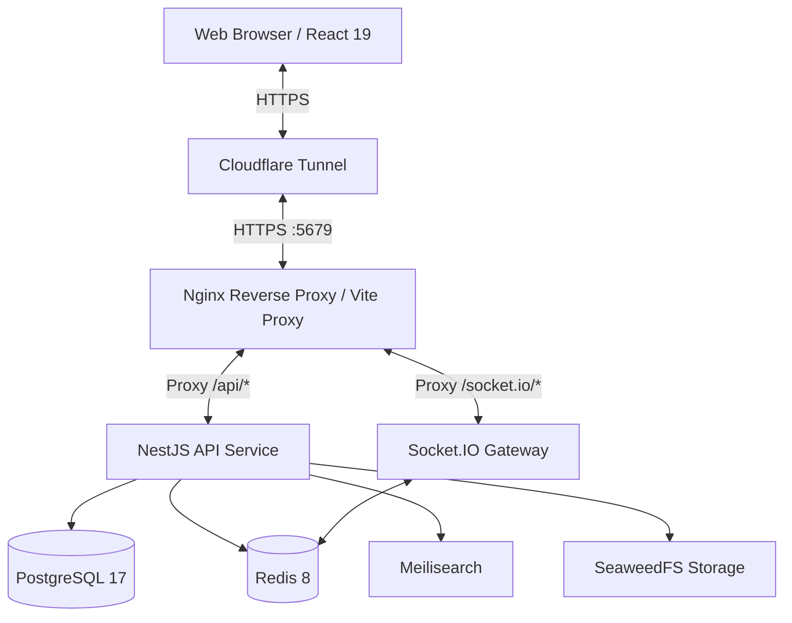
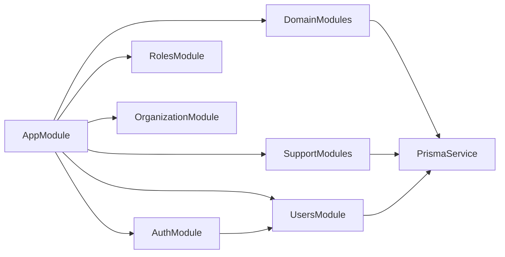
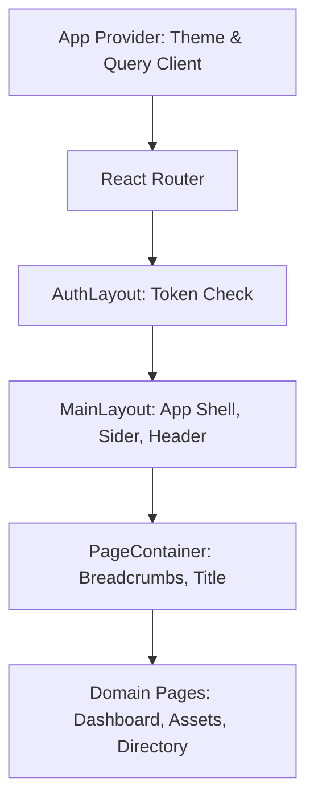

# System Architecture

## Architecture Style
The Unified IT Management System (UIMS) follows a Modular Monolith architecture pattern. It's built as a React SPA frontend communicating with a NestJS REST API, with real-time updates via WebSockets. It uses a strict monorepo strategy (via pnpm workspaces and Turborepo) where types and validators are shared across the full stack.
The system relies on Docker Compose to orchestrate dependencies like PostgreSQL, Redis, Meilisearch, and SeaweedFS. It proxies traffic through a single port (5679) via Vite's proxy for local dev or Nginx for production, providing a unified HTTPS entrypoint.

## System Diagram

## Backend Architecture
### Module Organization
The NestJS backend (`apps/api`) is organized into feature-centric modules:
- **Core Modules**: `auth`, `users`, `roles`, `organization` (for identity and access)
- **Domain Modules**: `assets`, `licenses`, `inventory`, `network`, `directory` (for core business domains)
- **Support Modules**: `audit`, `dashboard`, `reports`, `notifications`, `search`, `settings`, `health` (for system operations and analytics)

### Request Lifecycle
A typical API request follows this flow:
1. **Request Reception**: Nginx / Vite dev server proxies request to NestJS.
2. **Global Middlewares/Guards**: Authentication via Passport JWT. The `@Roles` decorator limits access.
3. **Controller**: e.g., `UsersController.findAll()`. Validates incoming DTOs using shared Zod schemas (via custom pipes/interceptors) or `class-validator`.
4. **Service**: e.g., `UsersService.findAll()`. Evaluates business logic and constructs database query.
5. **Database**: Prisma ORM executes bounded/paginated queries against PostgreSQL.
6. **Response**: Data is wrapped in a standard API envelope (`{ success: true, data: T, timestamp: string }`) and returned to client.

### Data Flow (WebSockets)
WebSockets (`NotificationsGateway` on `/notifications` namespace) handle real-time synchronization:
- Client establishes connection with JWT via `auth.token`.
- Gateway joins client to `user:${userId}` and `role:${role}` rooms.
- Backend services inject `NotificationsGateway` and emit events (`notification:new`, `notification:count`) without cyclic dependencies.
- Connected clients react via React stores and TanStack Query invalidation.

## Frontend Architecture
### Component Hierarchy
The React application (`apps/web`) uses Ant Design v6 and follows a strict layout-driven component structure:

### Routing
Routing is governed by `react-router` v8 in `apps/web/src/app/router.tsx`:
- `/login` (Public route)
- `/` (Protected by `AuthLayout`, provides `MainLayout`)
  - Domain routes: `/assets`, `/licenses`, `/directory`, `/network`, `/inventory`, `/access-control`, `/organization`, `/audit`, `/reports`, `/notifications`, `/settings`

### State Management
- **Server State**: Managed exclusively by TanStack Query (`@tanstack/react-query`). Network calls rely on `Axios` clients in `src/services/`.
- **Client State**: Managed by Zustand (`src/stores/`). For example, `theme.store.ts` controls dark mode, compact mode, and Ant Design token parameters.
- **Dynamic Context**: UI Feedback (notifications, messages, modals) strictly consumes `App.useApp()` from Ant Design to ensure theme context consistency.

## Cross-Cutting Concerns
### Authentication & Authorization
- Backend: Passport JWT with short-lived access tokens and refresh tokens. Role-Based Access Control (RBAC) enforced via `@Roles` and `@RequirePermissions` decorators.
- Frontend: `AuthLayout` enforces token existence. Missing tokens redirect to `/login`.

### Error Handling
- Backend: Global Exception Filters map errors to standardized JSON formats. Strict "Zero Silent Catch" policy is enforced; all errors must be logged or re-thrown as `HttpException`.
- Frontend: Route-level boundaries (`RouteErrorBoundary`), component boundaries (`ErrorBoundary`), and standard API interceptors that display errors using `App.useApp().message.error`.

### Logging & Monitoring
- Backend: Structured logging via `pino` and NestJS `Logger`. Raw `console.log` is forbidden.
- Frontend: Explicitly bans raw `console.log` in production, preferring structured feedback or error boundaries.
