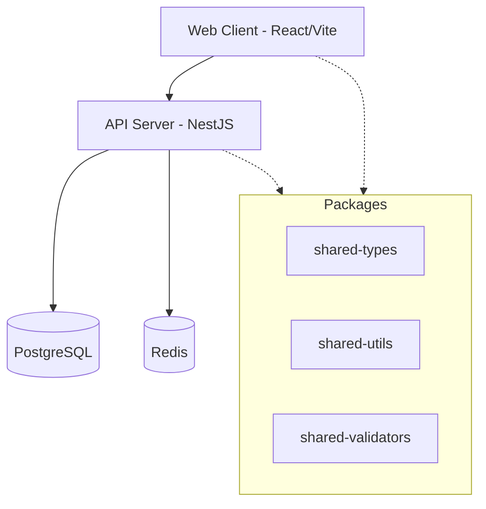

# Architecture Overview
**Analysis Date:** 2026-08-20

## System Overview
UIMS (Unified IT Management System) is a monorepo application containing a NestJS backend API and a React frontend application, supported by shared utility packages.

## Monorepo Structure
The project uses `pnpm` workspaces and `turbo` for build system orchestration.
- **`apps/api/`**: The backend application built with NestJS.
- **`apps/web/`**: The frontend SPA built with React, Vite, and Ant Design.
- **`packages/shared-types/`**: TypeScript types/interfaces for DTOs, entities, and enums.
- **`packages/shared-utils/`**: Reusable utility functions (formatting, timezone handling, etc.).
- **`packages/shared-validators/`**: Zod schemas used for validation across the stack.

## Backend Architecture
Built with NestJS (v11) following a modular architectural style.
- **Modules**: Domain-driven feature modules (e.g., Auth, Users, Assets, Inventory).
- **Core Components**: 
  - `ThrottlerGuard` for rate limiting.
  - `JwtAuthGuard`, `RolesGuard`, `PermissionsGuard` for auth and authorization.
  - `AuditInterceptor` for tracing and auditing.
  - Global `ValidationPipe` for input validation.
  - `PrismaExceptionFilter` and `HttpExceptionFilter` for error mapping.
- **Database**: PostgreSQL with Prisma ORM.
- **Caching/Queuing**: Redis configured with BullMQ.
- **Security**: Helmet, strict CORS policy, and cookie parsing configured in `main.ts`.

## Frontend Architecture
Built with React 19, Vite, and TypeScript.
- **Routing**: `react-router` with lazy-loaded code-split routes (via `Suspense`).
- **State Management**: 
  - Global UI state and Theme are managed by `zustand`.
  - Server state caching and synchronization via `@tanstack/react-query`.
- **UI Components**: Ant Design (v6) with `@ant-design/pro-components`.
- **Pages**: Modular page directories (`dashboard`, `assets`, `users`, etc.) with local component and hook encapsulation.

## Shared Packages
- **`@uims/shared-types`**: Exports DTO interfaces, entity types, and domain enums to ensure backend and frontend type safety.
- **`@uims/shared-validators`**: Uses `zod` to provide cross-platform validation schemas (e.g., `user.validator.ts`, `asset.validator.ts`).
- **`@uims/shared-utils`**: Contains cross-platform logic (timezone conversions, formatting, enum operations, branded types).

## Data Flow
1. **Client Request**: A React component issues an API request (managed via Axios and React Query).
2. **Gateway**: Request enters NestJS; intercepted by `helmet` and `cors`, then validated by `ThrottlerGuard`.
3. **Authentication**: `JwtAuthGuard` ensures a valid token is present; `RolesGuard` checks RBAC.
4. **Validation**: The global `ValidationPipe` validates the request payload against Zod-backed DTOs.
5. **Controller → Service**: Controller maps the request to the domain service.
6. **Data Access**: Service interacts with `PrismaClient` or `RedisModule`.
7. **Response Logging**: `AuditInterceptor` and `TransformInterceptor` log the result and shape the JSON payload appropriately for the client.

## Key Architectural Decisions
- **Strict Monorepo Dependency Flow**: Packages do not depend on apps. The `web` and `api` apps consume `shared-*` packages to maintain DRY types and validation logic.
- **Lazy Loading**: Frontend splits code via `lazy()` to improve initial load performance.
- **Prisma & Zod**: Combining Prisma schemas with Zod ensures runtime and compile-time data integrity from database up to the UI.
- **Modular NestJS**: Grouping controllers and services by domain (e.g. `InventoryModule`) ensures clear bounded contexts within the backend.

---
*2026-08-20*
