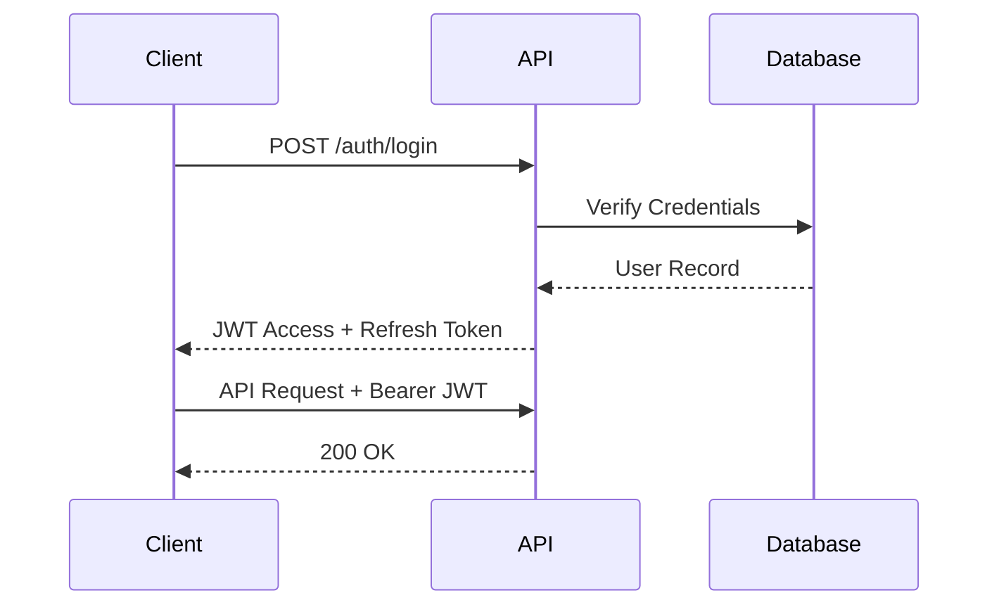
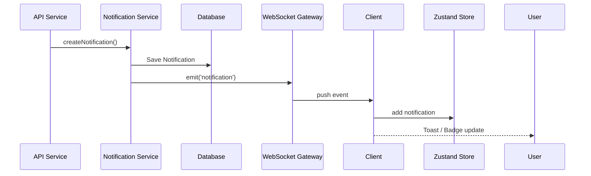

# System Architecture
> Last Updated: 2026-09-12

## High-Level Overview

The UIMS (Unified IT Management System) is built using a Modular Monolith API and a React SPA architecture, contained within a Turborepo/pnpm workspaces monorepo.

```mermaid
flowchart TD
    Client[Client (React SPA)]
    Nginx[Vite / Nginx]
    API[NestJS API]
    Prisma[Prisma ORM]
    Postgres[(PostgreSQL)]
    Redis[(Redis)]
    BullMQ[BullMQ Queues]
    
    Client -->|HTTP / REST| Nginx
    Client -->|WebSocket| API
    Nginx --> API
    API --> Prisma
    Prisma --> Postgres
    API --> Redis
    API --> BullMQ
    BullMQ --> Redis
```

- **Request flow:** Client → Vite (Dev) / Nginx (Prod) → NestJS → Prisma → PostgreSQL

## Backend Architecture

### Module Organization
The NestJS application (`apps/api`) follows a modular monolith approach:
- **`app.module.ts`**: Root module aggregating feature modules.
- **`auth.module.ts`**: Authentication (JWT, local login).
- **`assets.module.ts`**: Asset management (hardware tracking).
- **`directory.module.ts`**: Organization hierarchy, users, Active Directory/LDAP abstraction.
- **`inventory.module.ts`**: Inventory, item quantities.
- **`network.module.ts`**: IP Addresses, VLANs, Subnets tracking.
- **`licenses.module.ts`**: Software license management.
- **`notifications.module.ts`**: In-app notifications and WebSocket Gateway.
- **`audit.module.ts`**: Centralized audit logging.
- **`roles.module.ts`**: RBAC definitions and roles.
- **`reports.module.ts`**: Scheduled reporting engine.
- **`health.module.ts`**: Health checks.

**Cross-Cutting Concerns (Common):**
- **Guards:** `JwtAuthGuard`, `RolesGuard`, `PermissionsGuard`.
- **Interceptors:** `TransformInterceptor`, `AuditInterceptor`.
- **Filters:** `HttpExceptionFilter`, `PrismaExceptionFilter`.

### Data Model
Managed by Prisma ORM (`apps/api/prisma/schema.prisma`):
- **Core Entities:** `AppUser` (Login users), `DirectoryUser` (Employees), `Asset`, `License`, `VLAN`, `Subnet`, `IPAddress`.
- **Self-referential patterns:** 
  - `Location` (recursive CTEs used for hierarchical location tracking: Campus -> Building -> Floor -> Room).
  - `AssetCategory` and `Organization` / `Department` also use self-referential hierarchies.
- **Spatial / Hierarchical Filtering:** NestJS handles recursive CTEs or parent-child tree aggregation for `Location`.

### API Design
- **REST Patterns:** Controllers -> Services -> Repositories/Prisma.
- **DTO Validation:** Zod shared validators (`packages/shared-validators`) or class-validator (DTOs).
- **Error Handling:** Standardized via `PrismaExceptionFilter` and `HttpExceptionFilter`.

### Background Processing
- **Queue System:** BullMQ backed by Redis for background tasks (reports generation, email sending).
- **Workers:** NestJS processors handling jobs asynchronously.

### WebSocket Architecture
- **Gateway:** Built on `notifications.module.ts` with Socket.io/WebSocket.
- **Real-time Notifications:** Emits events when assets are assigned or system alerts trigger.
- **Auth Handshake:** Tokens passed during connection initiation to authenticate clients.

## Frontend Architecture

### Component Hierarchy
The React application (`apps/web`) uses Vite:
- **Routing:** React Router v7+ with lazy loading for feature modules.
- **Pages:** Top-level route components.
- **Layouts:** `MainLayout`, `AuthLayout` containing sidebars and headers.
- **Components:** Modular UI components (`components/`, `layouts/components/`).

### State Management
- **Zustand Stores:** Located in `src/stores/` (`auth.store.ts`, `theme.store.ts`, `notification-settings.store.ts`, `timezone.store.ts`).
- **Server State:** TanStack Query (`query-client.ts` and hooks like `useSystemHealth.ts`).

### Service Layer
- **API Client:** Axios instances with request/response interceptors to attach JWT and handle token refresh.
- **Realtime:** `hooks/useRealtimeNotifications.ts` for WebSocket bindings.

## Cross-Cutting Concerns
- **Authentication:** JWT-based auth flow. Login returns access and refresh tokens.
- **Authorization:** `useAccess` hooks on the frontend and `PermissionsGuard` on the backend.
- **Logging:** `AuditInterceptor` captures entity changes, storing diff payloads in `AuditLog` table.
- **CORS & Security:** Configured in NestJS bootstrap.

## Data Flow Diagrams

### Auth Flow


### Real-Time Notification Flow

