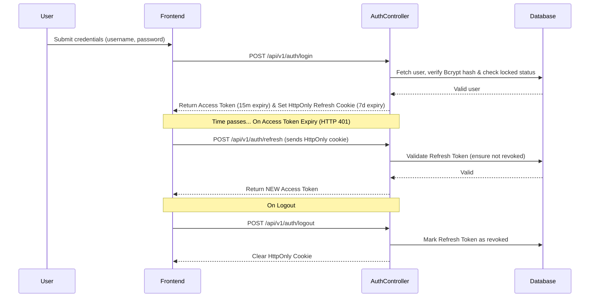

# UIMS System Architecture

This document provides a comprehensive, deep-dive overview of the Unified IT Management System (UIMS) architecture. Built to strictly adhere to 2026 enterprise engineering standards, it documents the structural decisions, data pipelines, security boundaries, and frontend strategies that power the platform.

## 1. Architecture Style & Module Dependency Graph

The UIMS backend is architected as a **Modular Monolith** using NestJS, housed in a Turborepo + PNPM workspace.

### Why Modular Monolith?
- It balances the deployment simplicity of a monolithic application with the strict bounded contexts typically found in microservices. 
- Domain modules are heavily decoupled and communicate strictly through dependency injection. 
- This prevents the "big ball of mud" anti-pattern while avoiding the severe operational overhead (e.g., network latency, complex distributed tracing, eventual consistency issues) of microservices.

### Detailed Module Dependency Graph
The NestJS application leverages hierarchical imports:

- **`AppModule` (Root)**
  - Acts as the global orchestrator.
  - Imports all domain and core modules.

- **Core (Global) Modules**:
  - `ConfigModule`: Validates and loads environment variables, providing a unified configuration interface.
  - `PrismaModule`: Encapsulates the Prisma Client, providing a global database access layer.
  - `RedisModule`: Manages connections to the Redis 8 instance for caching and background job deduplication.
  - `ScheduleModule`: Orchestrates chron-based background workers.
  - `ThrottlerModule`: Enforces global API rate limiting parameters (e.g., 1000 requests per minute).

- **Domain Modules**:
  - Represent specific bounded contexts.
  - Include: `AssetsModule`, `UsersModule`, `InventoryModule`, `LicensesModule`, `DirectoryModule`, etc.

- **Cross-Domain Dependencies**:
  - **PrismaModule**: Almost all domain modules depend on this for data persistence.
  - **AuditModule**: Domain modules implicitly depend on this logic via the global `AuditInterceptor` (which logs mutations).
  - **SearchModule**: Relies heavily on database records from `AssetsModule`, `LicensesModule`, and `DirectoryModule` during its asynchronous sync pipelines.
  - **NotificationsModule**: Provides the WebSocket gateway and relies on `RedisModule` for distributed lock/throttling and `PrismaModule` for complex alerting query logic.

## 2. API Design & DTO Transformation Pipeline

The API adheres strictly to RESTful principles.

- **REST Versioning**: 
  - Globally prefixed with `/api/v1` to support future non-breaking schema evolutions.
- **OpenAPI Integration**: 
  - Exposed at `/api/v1/docs` (Swagger v2.4.0).
  - Generates interactive API contract documentation dynamically from DTOs.

### Transformation & Validation Pipeline
1. **Incoming Request**: Reaches the NestJS controller route matching the HTTP verb and path.
2. **ValidationPipe**: The request body passes through a global pipe powered by `class-validator` and `class-transformer`.
   - `whitelist: true`: Automatically strips unknown, non-whitelisted properties from the payload before they reach the controller.
   - `forbidNonWhitelisted: true`: Immediately throws an HTTP 400 Bad Request if extra properties exist, preventing mass assignment and parameter pollution vulnerabilities.
   - `transform: true`: Automatically transforms plain JavaScript objects into properly instanced DTO classes.
3. **Controller & Service Layer**: Executes the business logic using the strictly-typed DTO.
4. **TransformInterceptor**: Wraps all successful outbound responses in a standardized enterprise envelope: `{ success: true, data: T, timestamp: ISOString }`.

## 3. Authentication & Authorization

The platform enforces a secure, stateless JWT strategy utilizing short-lived access tokens combined with secure refresh token rotation.

### Authentication Flow Diagram

### Authorization
- Enforced via a chain of global guards. 
- `JwtAuthGuard`: Verifies token integrity.
- `RolesGuard` and `PermissionsGuard`: Evaluate granular Attribute-Based Access Control (ABAC) rules persisted in the Prisma database (verifying `action`, `subject`, and JSON `conditions`).

## 4. WebSocket Architecture

Real-time events and alerts are managed by the `NotificationsGateway`, operating on the `/notifications` namespace.

- **Connection Lifecycle & Security**: 
  - Sockets authenticate via `socket.handshake.headers.authorization` or `auth.token`.
  - To prevent credential leakage in proxy access logs, token transport via URL query parameters is explicitly blocked and rejected.
  - The authentication process is fail-closed, mandating a non-empty string role claim before connection is established.
- **Room Management**: 
  - Upon successful authentication, clients are subscribed to targeted broadcast channels: `user:{userId}` and `role:{role}`.
- **Event Broadcasting**: 
  - The server emits scoped events like `notification:new`, `notification:count`, and `notification:cleared` strictly to these authenticated rooms.
- **Graceful Shutdown**: 
  - The `onModuleDestroy` lifecycle hook broadcasts a `server_shutdown` event, alerting clients to reconnect, and cleanly disconnects all active socket instances before Node.js exits.

## 5. Audit Trail Architecture

Enterprise-grade tamper-evident audit logging is seamlessly integrated via the `AuditInterceptor`.

- **Capture Mechanism**: 
  - Automatically intercepts all mutation requests (`POST`, `PATCH`, `PUT`, `DELETE`).
- **Diffs & Data Redaction**: 
  - Captures the request payload (`diffPayload`).
  - Automatically redacts highly sensitive fields (e.g., passwords, JWT tokens, credit cards, API keys) using a recursive `sanitizePayload` utility before serialization.
- **Tamper Evidence Security**: 
  - Computes a SHA-256 HMAC hash (`computeAuditHash`) concatenating the timestamp, user ID, action, entity name, status, IP address, and stringified payload.
  - Signs the hash with the `AUDIT_SIGNING_KEY`.
- **Storage**: 
  - Asynchronously persists the record to the `AuditLog` Prisma model using `performance.now()` to track execution duration, without blocking or slowing the HTTP response to the client.

## 6. CORS Architecture

The centralized CORS strategy in `cors.config.ts` balances strict production security with seamless developer ergonomics.

- **Production (`NODE_ENV=production`)**: 
  - Validates incoming origins against an explicit, comma-separated list of `CORS_ORIGIN` environment variables.
  - If undefined or misconfigured, it aggressively fails safe to an empty array `[]`, ensuring zero localhost or wildcard leakage in production environments.
- **Development / Non-Production**:
  - Dynamically permits standard loopback interfaces (`localhost`, `127.0.0.1`, `0.0.0.0`) across common Vite, React, and NestJS development ports.
  - Employs a strict regex (`CLOUDFLARE_DEV_ORIGIN_REGEX`) to securely permit Cloudflare quick tunnel subdomains (`*.trycloudflare.com`) for remote preview sharing.

## 7. Scheduled Workers

Background jobs and proactive alerting are orchestrated via the `@nestjs/schedule` module.

- **ScheduledAlertsWorker**: Executes a proactive daily cron job (`@Cron('0 0 * * *')`) that runs concurrent scans.
  - **Expiring Licenses**: Scans for software licenses expiring in 30, 15, 7, 1 days (or already expired), automatically updating database statuses from `ACTIVE` to `EXPIRING_SOON` or `EXPIRED`.
  - **Asset Warranties**: Checks hardware warranties and sends tiered alerts to administrators.
  - **Maintenance Overdue**: Identifies hardware assets stuck in `MAINTENANCE` status for more than 14 days, flagging them for review.
  - **Low Stock Inventory**: Queries the inventory for consumable items where `quantity <= minThreshold`.
  - **Redis Throttling**: Dispatches these alerts through Redis using a TTL-based deduplication lock to prevent duplicate notification spam if the cron job is triggered manually or restarted.

## 8. Search Sync Pipeline

Global, instantaneous search functionality utilizes **MeiliSearch** for typo-tolerant, sub-50ms queries.

- **Index Management**: 
  - Abstracts MeiliSearch connectivity inside `SearchService`, performing health checks on module initialization.
- **Sync Pipeline (`syncAllToMeilisearch`)**: 
  - Executes batched (100 items), cursor-based pagination queries against Postgres to avoid memory bloat.
  - Formats the schema, and ships the documents via REST to MeiliSearch.
- **Entity Coverage**: 
  - Actively synchronizes Hardware Assets, Software Licenses, and Directory Users.
- **Graceful Fallback Strategy**: 
  - If MeiliSearch goes offline or connection times out, `searchDatabaseFallback` smoothly degrades functionality.
  - Executes parallel Prisma queries utilizing `mode: 'insensitive'` ILIKE conditions to guarantee uninterrupted search availability.

## 9. Frontend Routing Architecture

Built natively on **React 19.3** and **React Router v8.3**, the frontend uses an object-based routing configuration (`createBrowserRouter` defined in `router.tsx`).

- **Layout Nesting**: 
  - `AuthLayout`: Enforces token presence and redirects unauthenticated users to `/login`.
  - `MainLayout`: Renders the authenticated application shell, utilizing Ant Design Pro's sidebar and header components.
- **Code Splitting & Lazy Loading**: 
  - Domain pages (e.g., `DashboardPage`, `AssetsPage`, `LicensesPage`) are dynamically imported using `React.lazy()`.
  - Pages are wrapped in `<Suspense>` boundaries featuring a branded `PageLoader`.
- **Fault Tolerance**: 
  - A custom `RouteErrorBoundary` catches rendering panics or chunk-loading failures at the specific route level, preserving the rest of the application shell.

## 10. Frontend Service Layer

API communication is heavily centralized in `services/api.ts`, utilizing Axios interceptors to abstract authentication complexity.

- **Token Injection**: 
  - The request interceptor seamlessly injects the JWT from the Zustand store (`useAuthStore`).
- **Concurrent Refresh Token Rotation**: 
  - The response interceptor catches `HTTP 401 Unauthorized` responses (explicitly excluding `/auth/login` and `/auth/refresh` endpoints).
  - Pauses all incoming parallel HTTP requests using a promise queue (`failedQueue`).
  - Attempts a silent refresh against `/auth/refresh`.
  - Upon success, flushes the queue, retrying all pending requests with the newly minted token. 
  - On failure, triggers `handleAuthRedirect()` to securely wipe local state and force a re-login.

## 11. Theme System

The UI implements **Ant Design v6.6** integrated tightly with custom Zustand state (`theme.store.ts`).

- **ConfigProvider Setup**: 
  - `App.tsx` memoizes a dynamic `themeConfig` constructed from user preferences.
  - Manages dark/light mode toggles, compact mode density, and brand color presets by mapping Zustand state to Ant Design CSS Design Tokens.
  - Deeply merged with `@ant-design/pro-components` via `ProConfigProvider` to ensure standardized, theme-compliant data tables, layouts, and forms across the entire application ecosystem.
