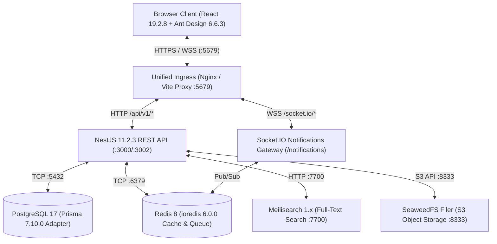
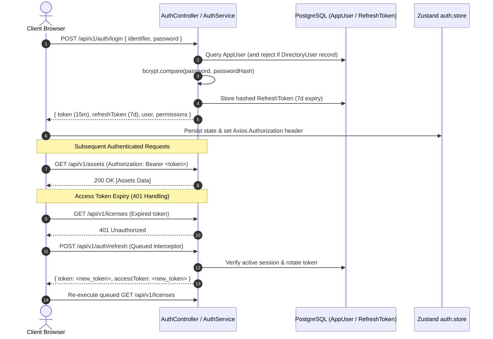

# System Architecture

## Architectural Topology
The Unified IT Management System (UIMS) is structured as an enterprise-grade **Modular Monolith** backend coupled with a decoupled **Single Page Application (SPA)** frontend, coordinated within a high-performance monorepo via [pnpm 11.21.0](file:///home/user/projects/uims/package.json#L7) workspaces and [Turborepo 2.10.12](file:///home/user/projects/uims/package.json#L51).



Production environments bundle the React SPA into static assets served via Nginx with TLS termination, while local development employs Vite's internal HTTPS proxy on port 5679. Both forward `/api/v1/*` and WebSocket connections (`/socket.io/*`) to the backend container.

---

## Request Lifecycle & Security Pipeline

All incoming HTTP requests pass through an ordered, defense-in-depth pipeline declared in [main.ts](file:///home/user/projects/uims/apps/api/src/main.ts#L19-L81) and [app.module.ts](file:///home/user/projects/uims/apps/api/src/app.module.ts#L58-L79):

```
HTTP Request
  │
  ├── 1. Helmet Security Headers (HSTS preload, frameguard, XSS protection)
  ├── 2. Strict CORS Middleware (Origin allowlist + *.trycloudflare.com in dev)
  ├── 3. Global Guard Chain (APP_GUARD execution order):
  │     ├── a. ThrottlerGuard (Rate limit: 1000 req / 60s window)
  │     ├── b. JwtAuthGuard (Passport JWT validation; skipped if @Public() marked)
  │     ├── c. RolesGuard (Role hierarchy: SUPER ADMIN > ADMIN > MANAGER/TECH/AUDITOR)
  │     └── d. PermissionsGuard (Fine-grained subject:action ABAC check against DB/token)
  ├── 4. Global ValidationPipe (whitelist: true, transform: true, forbidNonWhitelisted: true)
  ├── 5. Controller Handler (Route execution & DTO binding)
  ├── 6. Domain Service (Business logic execution via PrismaService)
  ├── 7. Interceptor Pipeline:
  │     ├── AuditInterceptor (Captures non-GET mutations, signs payload via HMAC-SHA256)
  │     └── TransformInterceptor (Wraps payload in standard envelope {success, data, timestamp})
  └── 8. Exception Filters (HttpExceptionFilter & PrismaExceptionFilter standard envelope mapping)
```

### Concrete Pipeline Examples
1. **Guard Execution Order** ([app.module.ts](file:///home/user/projects/uims/apps/api/src/app.module.ts#L60-L74)): Registered via NestJS dependency injection token `APP_GUARD`. `ThrottlerGuard` fires first, followed by `JwtAuthGuard`, `RolesGuard`, and `PermissionsGuard`.
2. **Standard API Envelope** ([transform.interceptor.ts](file:///home/user/projects/uims/apps/api/src/common/interceptors/transform.interceptor.ts#L10-L26)):
   ```json
   {
     "success": true,
     "data": { "id": "uuid", "name": "Core Switch" },
     "timestamp": "2026-09-11T00:00:00.000Z"
   }
   ```
3. **Tamper-Evident HMAC Audit Logging** ([audit.interceptor.ts](file:///home/user/projects/uims/apps/api/src/common/interceptors/audit.interceptor.ts#L72-L89)): Non-GET requests trigger `computeAuditHash`, generating an HMAC-SHA256 digest using `AUDIT_SIGNING_KEY` over `timestamp|userId|action|entity|status|ip|payloadStr` after redacting sensitive tokens and credentials.

---

## Module Dependency Graph

The backend enforces modular domain boundaries. Global infrastructure modules provide singletons without cyclical cross-dependencies:

```mermaid
flowchart LR
    subgraph Global Infra Modules
        PrismaModule["PrismaModule (Database)"]
        RedisModule["RedisModule (RedisService)"]
        ConfigModule["ConfigModule (Zod Schema)"]
    end

    subgraph Identity & Access
        AuthModule["AuthModule"]
        UsersModule["UsersModule"]
        RolesModule["RolesModule"]
        DirectoryModule["DirectoryModule"]
    end

    subgraph Core Domain Modules
        AssetsModule["AssetsModule"]
        LicensesModule["LicensesModule"]
        InventoryModule["InventoryModule"]
        NetworkModule["NetworkModule"]
        OrganizationModule["OrganizationModule"]
    end

    subgraph Observability & Operations
        AuditModule["AuditModule"]
        NotificationsModule["NotificationsModule"]
        ReportsModule["ReportsModule"]
        DashboardModule["DashboardModule"]
        HealthModule["HealthModule"]
        SearchModule["SearchModule"]
        SettingsModule["SettingsModule"]
    end

    AuthModule --> UsersModule
    UsersModule --> PrismaModule
    RolesModule --> PrismaModule
    DirectoryModule --> PrismaModule
    Core Domain Modules --> PrismaModule
    Observability & Operations --> PrismaModule
    NotificationsModule --> RedisModule
    HealthModule --> RedisModule
```

### Module Dependency Rules
- **Zero Cyclic Dependencies**: Feature modules (`AssetsModule`, `NetworkModule`, `LicensesModule`) do not cross-import each other; cross-entity concerns link through Prisma relations or centralized domain services.
- **Global Provider Access**: `PrismaModule` ([prisma.module.ts](file:///home/user/projects/uims/apps/api/src/database/prisma.module.ts#L4)) and `RedisModule` ([redis.module.ts](file:///home/user/projects/uims/apps/api/src/common/redis/redis.module.ts#L6)) are annotated with `@Global()`, allowing any module to inject `PrismaService` or `RedisService`.

---

## Authentication & Authorization Flow



### Key Security Policies
1. **Strict Directory Record Isolation** ([auth.service.ts](file:///home/user/projects/uims/apps/api/src/modules/auth/auth.service.ts#L34-L70)): Corporate directory employees (`DirectoryUser`) are physically blocked from logging into the management interface. Only system accounts (`AppUser`) possess password hashes and assigned roles.
2. **Dual-Token Refresh Queue** ([api.ts](file:///home/user/projects/uims/apps/web/src/services/api.ts#L46-L107)): Frontend Axios response interceptors pause concurrent failed requests, request a new access token via `/auth/refresh`, and replay all queued operations transparently without UI disruption.

---

## Real-Time Notification Architecture

Real-time events utilize a WebSocket architecture implemented via NestJS `@WebSocketGateway` and Socket.IO:

- **Gateway Configuration** ([notifications.gateway.ts](file:///home/user/projects/uims/apps/api/src/modules/notifications/notifications.gateway.ts#L38-L59)): Binds to namespace `/notifications` with CORS validation matching application ingress.
- **Authentication Handshake** ([notifications.gateway.ts](file:///home/user/projects/uims/apps/api/src/modules/notifications/notifications.gateway.ts#L74-L117)): Validates JWT from `socket.handshake.auth.token` or HTTP `Authorization` header during connection. Unauthenticated sockets are severed immediately.
- **Room Isolation** ([notifications.gateway.ts](file:///home/user/projects/uims/apps/api/src/modules/notifications/notifications.gateway.ts#L176-L178)): Connected sockets auto-join two isolated rooms: `user:${userId}` (targeted alerts) and `role:${role}` (role broadcasts).
- **Client Synchronization** ([useRealtimeNotifications.ts](file:///home/user/projects/uims/apps/web/src/hooks/useRealtimeNotifications.ts#L112-L189)): Client receives `notification:new`, updates unread counters, pops non-blocking Ant Design toasts, and optionally plays an audio chime via the HTML5 Web Audio API.

---

## Data Model & Schema Topology

The persistence model consists of 28 Prisma models ([schema.prisma](file:///home/user/projects/uims/apps/api/prisma/schema.prisma)) organized into distinct logical domains:

| Domain Cluster | Key Models | Cardinality & Relationships |
| :--- | :--- | :--- |
| **System IAM** | `AppUser`, `Role`, `Permission`, `RolePermission`, `RefreshToken` | `Role` has many `AppUser` and `RolePermission`; `AppUser` has many `RefreshToken` |
| **Corporate HR** | `DirectoryUser`, `DirectoryGroup`, `DirectoryMembership` | `DirectoryUser` belongs to `Department`/`Location`; assigned to `Asset` and `LicenseAssignment` |
| **Org Structure** | `Organization`, `Location`, `Department`, `Position`, `Vendor` | `Organization` has many `Location` and `Department`; `Vendor` supplies `Asset` and `License` |
| **Asset & CMDB** | `Asset`, `AssetCategory`, `AssetHistory` | `Asset` belongs to `AssetCategory`, `Location`, `DirectoryUser`; tracks delta in `AssetHistory` |
| **Software & Licensing**| `License`, `LicenseAssignment` | `License` belongs to `Vendor`; allocated via `LicenseAssignment` to `DirectoryUser` or `Asset` |
| **Consumables** | `InventoryCategory`, `InventoryItem` | `InventoryItem` belongs to `InventoryCategory`, `Location`, `Vendor` |
| **IPAM & Network** | `VLAN`, `Subnet`, `IPAddress`, `NetworkCredential` | `VLAN` has many `Subnet`; `Subnet` has many `IPAddress`; `IPAddress` optionally binds to `Asset` |
| **Audit & Jobs** | `AuditLog`, `Notification`, `Setting`, `ReportSchedule` | `AuditLog` records tamper-proof hashes; `ReportSchedule` drives BullMQ / cron executions |

---

## Security Governance Matrix

| Security Layer | Implementation Mechanism | Concrete Location |
| :--- | :--- | :--- |
| **Transport Security** | TLS Termination, HSTS (max-age: 31536000), frameguard, no-sniff | [main.ts:L20-L30](file:///home/user/projects/uims/apps/api/src/main.ts#L20-L30) |
| **CORS Governance** | Strict origin allowlist, credentials enabled, dynamic cloudflare tunnel dev bypass | [main.ts:L49-L66](file:///home/user/projects/uims/apps/api/src/main.ts#L49-L66) |
| **DDoS & Rate Limiting**| `ThrottlerModule` (1000 req/min global, 5 req/min on `/auth/login`) | [auth.controller.ts:L26](file:///home/user/projects/uims/apps/api/src/modules/auth/auth.controller.ts#L26) |
| **Input Sanitization** | `ValidationPipe` with whitelist & parameter pollution protection | [main.ts:L72-L78](file:///home/user/projects/uims/apps/api/src/main.ts#L72-L78) |
| **Role-Based Access** | Hierarchical `@Roles()` decorator evaluating `Super Admin` and `Admin` rights | [roles.guard.ts:L33-L45](file:///home/user/projects/uims/apps/api/src/common/guards/roles.guard.ts#L33-L45) |
| **Permission-Based Access**| Fine-grained `@RequirePermissions()` evaluated against token and DB permissions | [permissions.guard.ts:L46-L71](file:///home/user/projects/uims/apps/api/src/common/guards/permissions.guard.ts#L46-L71) |
| **Data Integrity** | HMAC-SHA256 signing of state-changing payloads with sensitive data redaction | [audit.interceptor.ts:L72-L89](file:///home/user/projects/uims/apps/api/src/common/interceptors/audit.interceptor.ts#L72-L89) |
