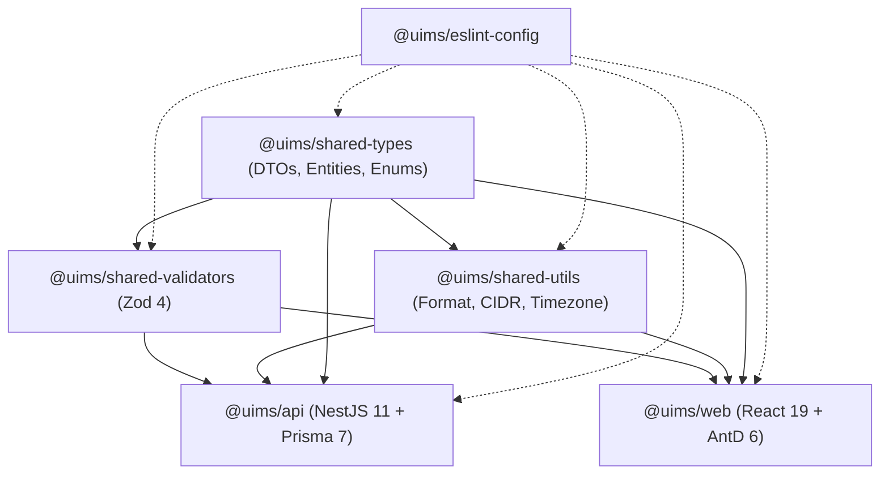

# Codebase Structure Map

## Monorepo Directory Tree

```
uims/
├── apps/
│   ├── api/                          # NestJS 11.2.3 REST API & WebSocket service
│   │   ├── prisma/
│   │   │   ├── schema.prisma          # 28 models, 649 lines (PostgreSQL 17 schema)
│   │   │   ├── seed.ts                # Database seed data orchestrator
│   │   │   └── scripts/               # Migration and Excel/CSV batch import scripts
│   │   ├── src/
│   │   │   ├── main.ts                # Bootstrap, Helmet, CORS, Swagger, Global Pipes
│   │   │   ├── app.module.ts          # Root module importing 16 feature modules
│   │   │   ├── config/                # App configuration & Zod env validation
│   │   │   ├── database/              # Global PrismaModule & PrismaService
│   │   │   ├── common/                # Shared decorators, guards, filters, interceptors, Redis
│   │   │   └── modules/               # 16 domain feature modules
│   │   ├── package.json
│   │   └── tsconfig.json
│   └── web/                          # React 19.2.8 SPA with Ant Design 6.6.3
│       ├── src/
│       │   ├── main.tsx               # ReactDOM root bootstrap
│       │   ├── app/                   # App root, router, TanStack Query client, theme config
│       │   ├── components/            # Reusable UI components (Access/Can, PageContainer, ErrorBoundary)
│       │   ├── hooks/                 # Custom React hooks (useAccess, useRealtimeNotifications)
│       │   ├── layouts/               # Shell layouts (MainLayout, AuthLayout, sidebar components)
│       │   ├── pages/                 # 13 lazy-loaded domain page modules
│       │   ├── services/              # Axios HTTP service layer (15 domain API clients)
│       │   ├── stores/                # Zustand stores (auth, theme, timezone, notification-settings)
│       │   └── styles/                # Global CSS overrides & token styles
│       ├── vite.config.ts             # Vite 8.2.2 bundler, local HTTPS, manual chunk splitting
│       └── package.json
├── packages/
│   ├── shared-types/                  # DTO interfaces, entities, enums (compiled via tsdown 0.23.0)
│   ├── shared-validators/             # Zod 4.5.4 schemas mirroring DTOs for frontend/backend validation
│   ├── shared-utils/                  # CIDR calculation, Day.js timezones, string formatting
│   └── eslint-config/                 # Unified TypeScript ESLint 8.70.0 flat configs
├── docker/                            # PostgreSQL 17 init SQL, Nginx reverse proxy, SSL certs
├── scripts/
│   └── dev.sh                         # Stack orchestration daemon (start, stop, restart, logs, tunnel)
├── docker-compose.yml                 # 8 production container definitions
├── turbo.json                         # Turborepo 2.10.12 pipeline tasks (build, dev, test, lint)
├── pnpm-workspace.yaml                # Workspace package declarations
└── package.json                       # Monorepo scripts & dependencies
```

---

## Workspace Package Graph

Inter-package dependencies enforce strict one-way compilation boundaries:



### Build & Compilation Rules
- Shared packages compile via [tsdown 0.23.0](file:///home/user/projects/uims/packages/shared-types/package.json#L22) into dual ESM targets (`.mjs` and `.d.mts`).
- Turborepo executes topological builds via `^build` task boundaries in [turbo.json](file:///home/user/projects/uims/turbo.json#L6).

---

## Key File Index

| File Path | Component | Functional Role |
| :--- | :--- | :--- |
| [apps/api/src/main.ts](file:///home/user/projects/uims/apps/api/src/main.ts) | API Bootstrap | Ingress setup, Helmet, strict CORS policy, global filters, Swagger 2.4.0 documentation. |
| [apps/api/src/app.module.ts](file:///home/user/projects/uims/apps/api/src/app.module.ts) | Root Module | Registers 16 domain modules and configures global `APP_GUARD` and `APP_INTERCEPTOR` order. |
| [apps/api/src/config/app.config.ts](file:///home/user/projects/uims/apps/api/src/config/app.config.ts) | Config Engine | Zod-validated environment schema enforcing minimum key lengths and strict secrets. |
| [apps/api/src/database/prisma.service.ts](file:///home/user/projects/uims/apps/api/src/database/prisma.service.ts) | Database Service | Singleton Prisma Client with PostgreSQL connection pooling and lifecycle hook management. |
| [apps/api/src/common/interceptors/audit.interceptor.ts](file:///home/user/projects/uims/apps/api/src/common/interceptors/audit.interceptor.ts) | Security Interceptor | Asynchronous HMAC-SHA256 integrity logging for all state-changing REST endpoints. |
| [apps/web/src/app/App.tsx](file:///home/user/projects/uims/apps/web/src/app/App.tsx) | Frontend Entry | Mounts Ant Design ConfigProvider, TanStack QueryClientProvider, and dynamic theme tokens. |
| [apps/web/src/app/router.tsx](file:///home/user/projects/uims/apps/web/src/app/router.tsx) | Client Router | React Router 8 route definitions with code-split lazy-loading and route error boundaries. |
| [apps/web/src/services/api.ts](file:///home/user/projects/uims/apps/web/src/services/api.ts) | HTTP Client | Axios instance with queued token auto-refresh and automatic authorization header injection. |
| [apps/web/src/stores/auth.store.ts](file:///home/user/projects/uims/apps/web/src/stores/auth.store.ts) | State Store | Zustand persistence store for tokens, active user profile, and RBAC/ABAC permission checks. |
| [apps/web/src/layouts/MainLayout.tsx](file:///home/user/projects/uims/apps/web/src/layouts/MainLayout.tsx) | Visual Shell | Responsive 280px/80px collapsible Sider, telemetry badge polling, and command palette. |
| [docker-compose.yml](file:///home/user/projects/uims/docker-compose.yml) | Service Stack | Defines PostgreSQL 17, Redis 8, Meilisearch, SeaweedFS S3, API, and Web containers. |
| [scripts/dev.sh](file:///home/user/projects/uims/scripts/dev.sh) | Stack Runner | Daemonized background stack launcher with healthchecks, log tailing, and Cloudflare tunnel. |

---

## Backend Module Structure Pattern

Every backend feature module follows a standard **Controller → Service → DTO → Module** pattern:

```
apps/api/src/modules/<domain>/
├── <domain>.controller.ts      # REST route handlers, HTTP verbs, Swagger annotations, @Roles
├── <domain>.service.ts         # Business logic, transactional Prisma queries, validation
├── <domain>.module.ts          # NestJS module declaration, provider registration, exports
├── dto/                        # Input transfer objects decorated with class-validator
│   ├── create-<entity>.dto.ts
│   └── update-<entity>.dto.ts
└── <domain>.controller.spec.ts # Vitest unit and isolation tests
```

### Concrete Pattern Examples
1. **Hardware Assets** ([modules/assets/](file:///home/user/projects/uims/apps/api/src/modules/assets/)):
   - Controller: [assets.controller.ts](file:///home/user/projects/uims/apps/api/src/modules/assets/assets.controller.ts)
   - Service: [assets.service.ts](file:///home/user/projects/uims/apps/api/src/modules/assets/assets.service.ts)
   - DTO: [dto/create-asset.dto.ts](file:///home/user/projects/uims/apps/api/src/modules/assets/dto/create-asset.dto.ts)
   - Module: [assets.module.ts](file:///home/user/projects/uims/apps/api/src/modules/assets/assets.module.ts)
2. **Network & IPAM** ([modules/network/](file:///home/user/projects/uims/apps/api/src/modules/network/)):
   - Controller: [network.controller.ts](file:///home/user/projects/uims/apps/api/src/modules/network/network.controller.ts)
   - Service: [network.service.ts](file:///home/user/projects/uims/apps/api/src/modules/network/network.service.ts)
   - Module: [network.module.ts](file:///home/user/projects/uims/apps/api/src/modules/network/network.module.ts)
3. **Directory Sync** ([modules/directory/](file:///home/user/projects/uims/apps/api/src/modules/directory/)):
   - Controller: [directory.controller.ts](file:///home/user/projects/uims/apps/api/src/modules/directory/directory.controller.ts)
   - Service: [directory.service.ts](file:///home/user/projects/uims/apps/api/src/modules/directory/directory.service.ts)
   - Module: [directory.module.ts](file:///home/user/projects/uims/apps/api/src/modules/directory/directory.module.ts)

---

## Frontend Page → Service → Store Mapping

The React frontend cleanly isolates view components, HTTP network communication, and client state:

| Route Path | View Component | HTTP Service Client | Client State & Cache |
| :--- | :--- | :--- | :--- |
| `/login` | [LoginPage.tsx](file:///home/user/projects/uims/apps/web/src/pages/auth/LoginPage.tsx) | [auth.service.ts](file:///home/user/projects/uims/apps/web/src/services/auth.service.ts) | `useAuthStore` (token & user profile) |
| `/` (Root) | [DashboardPage.tsx](file:///home/user/projects/uims/apps/web/src/pages/dashboard/DashboardPage.tsx) | [dashboard.service.ts](file:///home/user/projects/uims/apps/web/src/services/dashboard.service.ts) | TanStack Query `['dashboard-stats']` |
| `/assets` | [AssetsPage.tsx](file:///home/user/projects/uims/apps/web/src/pages/assets/AssetsPage.tsx) | [assets.service.ts](file:///home/user/projects/uims/apps/web/src/services/assets.service.ts) | TanStack Query `['assets', params]` |
| `/licenses` | [LicensesPage.tsx](file:///home/user/projects/uims/apps/web/src/pages/licenses/LicensesPage.tsx) | [licenses.service.ts](file:///home/user/projects/uims/apps/web/src/services/licenses.service.ts) | TanStack Query `['licenses']` |
| `/access-control`| [AccessControlPage.tsx](file:///home/user/projects/uims/apps/web/src/pages/access/AccessControlPage.tsx) | [roles.service.ts](file:///home/user/projects/uims/apps/web/src/services/roles.service.ts), [users.service.ts](file:///home/user/projects/uims/apps/web/src/services/users.service.ts) | `useAuthStore` (permissions cache) |
| `/directory` | [DirectoryPage.tsx](file:///home/user/projects/uims/apps/web/src/pages/directory/DirectoryPage.tsx) | [directory.service.ts](file:///home/user/projects/uims/apps/web/src/services/directory.service.ts) | TanStack Query `['directory-users']` |
| `/organization` | [OrganizationPage.tsx](file:///home/user/projects/uims/apps/web/src/pages/organization/OrganizationPage.tsx) | [organization.service.ts](file:///home/user/projects/uims/apps/web/src/services/organization.service.ts) | TanStack Query `['organization-tree']` |
| `/network` | [NetworkPage.tsx](file:///home/user/projects/uims/apps/web/src/pages/network/NetworkPage.tsx) | [network.service.ts](file:///home/user/projects/uims/apps/web/src/services/network.service.ts) | TanStack Query `['vlans', 'subnets', 'ips']` |
| `/inventory` | [InventoryPage.tsx](file:///home/user/projects/uims/apps/web/src/pages/inventory/InventoryPage.tsx) | [inventory.service.ts](file:///home/user/projects/uims/apps/web/src/services/inventory.service.ts) | TanStack Query `['inventory-items']` |
| `/audit` | [AuditPage.tsx](file:///home/user/projects/uims/apps/web/src/pages/audit/AuditPage.tsx) | [audit.service.ts](file:///home/user/projects/uims/apps/web/src/services/audit.service.ts) | TanStack Query `['audit-logs']` |
| `/reports` | [ReportsPage.tsx](file:///home/user/projects/uims/apps/web/src/pages/reports/ReportsPage.tsx) | [reports.service.ts](file:///home/user/projects/uims/apps/web/src/services/reports.service.ts) | TanStack Query `['report-schedules']` |
| `/notifications`| [NotificationsPage.tsx](file:///home/user/projects/uims/apps/web/src/pages/notifications/NotificationsPage.tsx) | [notifications.service.ts](file:///home/user/projects/uims/apps/web/src/services/notifications.service.ts) | `useNotificationSettingsStore` & WebSocket |
| `/settings` | [SettingsPage.tsx](file:///home/user/projects/uims/apps/web/src/pages/settings/SettingsPage.tsx) | [settings.service.ts](file:///home/user/projects/uims/apps/web/src/services/settings.service.ts) | `useThemeStore`, `useTimezoneStore` |

---

## Shared Workspace Packages Manifest

### 1. `@uims/shared-types` ([index.ts](file:///home/user/projects/uims/packages/shared-types/src/index.ts))
- **DTOs**: `ApiResponse<T>`, `PaginationDto`, `AuthDto`, `AssetQueryDto`, `LicenseDto`, `NetworkDto`, `InventoryDto`, `AuditDto`, `DirectoryDto`, `OrganizationDto`, `RoleDto`, `UserDto`.
- **Entities**: TypeScript interfaces representing all 28 database entities (`Asset`, `License`, `VLAN`, `Subnet`, `IPAddress`, `AuditLog`, `AppUser`, `DirectoryUser`).
- **Enums**: `AssetStatus`, `LicenseType`, `LicenseStatus`, `IPStatus`, `AccountStatus`, `DirectorySource`, `NotificationType`, `UserStatus`.

### 2. `@uims/shared-validators` ([index.ts](file:///home/user/projects/uims/packages/shared-validators/src/index.ts))
- **Validation Schemas**: Zod schemas for runtime request verification across frontend forms and backend validation pipes (`loginSchema`, `assetCreateSchema`, `licenseCreateSchema`, `networkSubnetSchema`, `directoryUserSchema`, `roleSchema`).

### 3. `@uims/shared-utils` ([index.ts](file:///home/user/projects/uims/packages/shared-utils/src/index.ts))
- **Network Calculations**: IPv4/IPv6 CIDR math, usable host range calculation, broadcast address derivation.
- **Timezone & Formatting**: Pre-configured Day.js instance with timezone support, currency formatting, byte size formatting.
- **String Utilities**: Slugification, sanitization, identifier generators.
