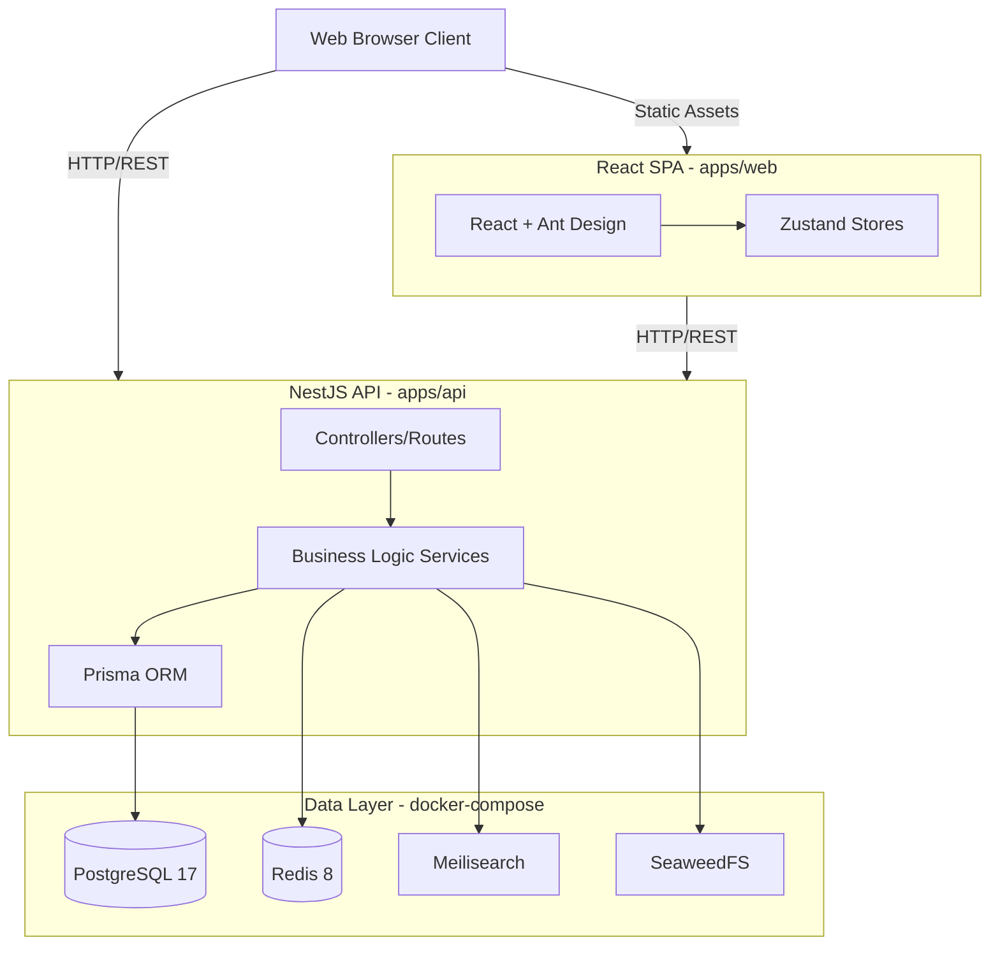

<!-- generated-by: gsd-doc-writer -->
# Architecture Overview

## System Overview
Unified IT Management System (UIMS) is an enterprise IT management platform designed to centralize the administration of IT infrastructure, assets, networks, and organizational structures.
- **Backend:** NestJS (Node.js) providing a modular RESTful API.
- **Frontend:** React Single Page Application (SPA) built with Vite and Ant Design.
- **Data Layer:** PostgreSQL (primary data store), Redis (caching and sessions), Meilisearch (full-text search engine), SeaweedFS (S3-compatible distributed file system for assets and documents).
- **Architecture Style:** Modular Monolith API with a React SPA frontend, deployed as containerized micro-services via Docker Compose.

## Component Diagram

## Data Flow
1. **Client Request:** The user triggers an action in the React SPA.
2. **API Call:** The frontend sends an HTTP request to the NestJS API.
3. **Authentication/Authorization:** The NestJS API uses Guards (e.g., `jwt-auth.guard.ts`, `permissions.guard.ts`) to validate the JWT and verify user permissions.
4. **Controller:** The request is routed to the appropriate module controller (e.g., `apps/api/src/modules/inventory/`).
5. **Business Logic:** The controller delegates to a service which coordinates data fetching or mutations.
6. **Data Access:** The service interacts with:
   - PostgreSQL via Prisma ORM for relational data.
   - Redis for caching or session-related checks.
   - Meilisearch for full-text search queries (if applicable).
   - SeaweedFS for fetching or uploading files.
7. **Response:** The API returns standard JSON payloads utilizing shared types and DTOs.
8. **Client Update:** The frontend updates its Zustand stores (e.g., `auth.store.ts`) and re-renders the UI components.

## Key Abstractions
- **Shared Types & DTOs:** Found in `packages/shared-types` (e.g., `packages/shared-types/src/index.ts`). These definitions are shared between the frontend and backend, ensuring strict type safety and a single source of truth across the monorepo.
- **NestJS Guards & Interceptors:** Core abstractions for authentication, authorization, and request handling. Key examples include `apps/api/src/common/guards/permissions.guard.ts` for RBAC and `jwt-auth.guard.ts`.
- **Zustand Stores:** Client-side state management abstractions. Found in `apps/web/src/stores/` (e.g., `auth.store.ts`, `theme.store.ts`, `timezone.store.ts`).
- **Prisma Schema:** Acts as the single source of truth for the database schema, located within `apps/api/prisma/`.
- **UI Components & Layouts:** Reusable structural and interactive components, such as `CommandPalette.tsx` and `MainLayout.tsx`, residing in `apps/web/src/components/` and `apps/web/src/layouts/`.

## Directory Structure Rationale
The monorepo leverages Turborepo (`turbo.json`) and pnpm workspaces to efficiently manage dependencies, boundaries, and build pipelines.
- `apps/api/`: Contains the NestJS backend API. It is carefully separated into domain-specific modules (`src/modules/*` such as `auth`, `inventory`, `network`, `dashboard`) to maintain clear boundaries and separation of concerns within the monolithic application.
- `apps/web/`: Contains the React frontend SPA. It organizes code into `pages`, `components`, `layouts`, and `stores`, following typical robust React application patterns.
- `packages/`: Houses shared libraries like `shared-types`, `shared-utils`, and `shared-validators`. This ensures that interfaces and utility functions used by both the frontend and backend do not drift, reducing duplication and errors.
- `docker-compose.yml`: Centralizes the infrastructure configuration, enabling developers to easily spin up the entire external dependency stack (PostgreSQL, Redis, Meilisearch, SeaweedFS) with a single command.
